# Todo App Development with Docker - Screenshots

This document shows the development process for the containerized Todo app, illustrating key steps, challenges, and learning points.

---

## 1. Creating the backend and frontend

- Started by creating a backend with **Express** and a frontend with **Vite + React**.
- Added basic CRUD functionality

---

## 2. Adding Dockerfiles

- Added a `Dockerfile` for **backend** with Node environment.
  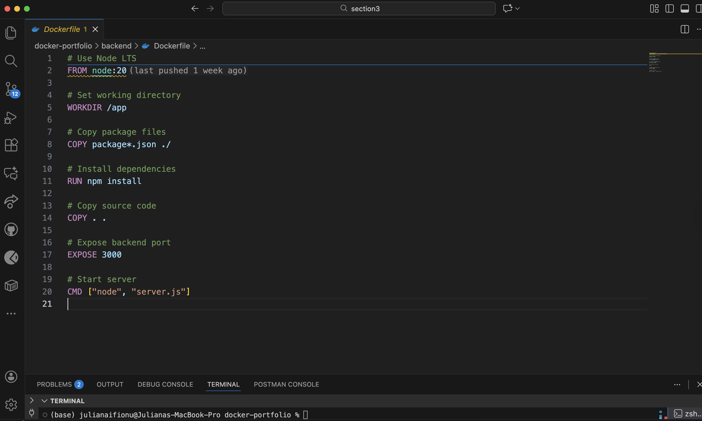

- Added a `Dockerfile` for **frontend** to serve the React app.
  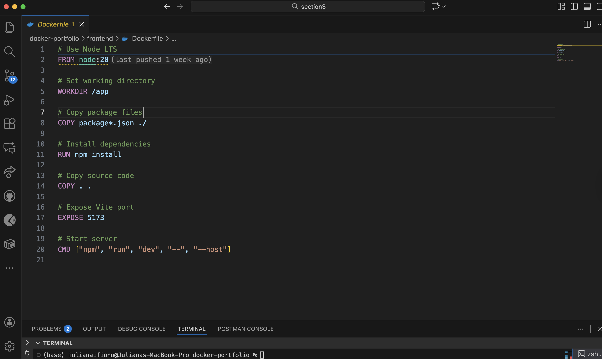

---

## 3. Writing `docker-compose.yml`

- Created a `docker-compose.yml` to orchestrate:
  - Backend
  - Frontend
  - MySQL
  - phpMyAdmin
- Configured service names, networks, and environment variables for database connection.

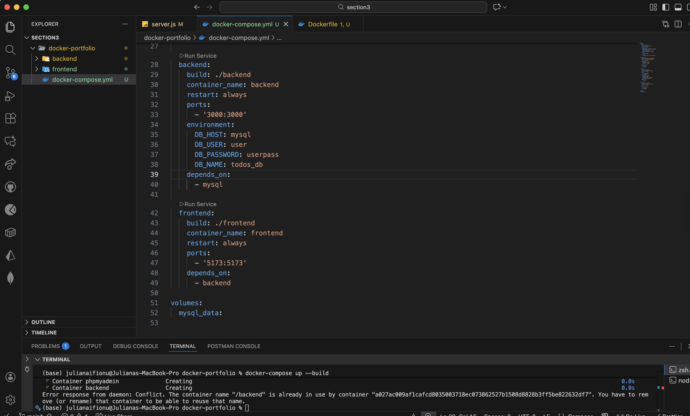

---

## 4. Building and running containers

- Ran `npm run start` to start my backend app.
- Initial errors:
  - Incorrect paths in Dockerfile/context
  - Database connection errors (`ENOTFOUND mysql`)
- Fixed by updating paths and ensuring I run docker compose up to build all my images rather than trying to start my backend app on my host machine.

- Ran `docker compose up --build` to build all images.

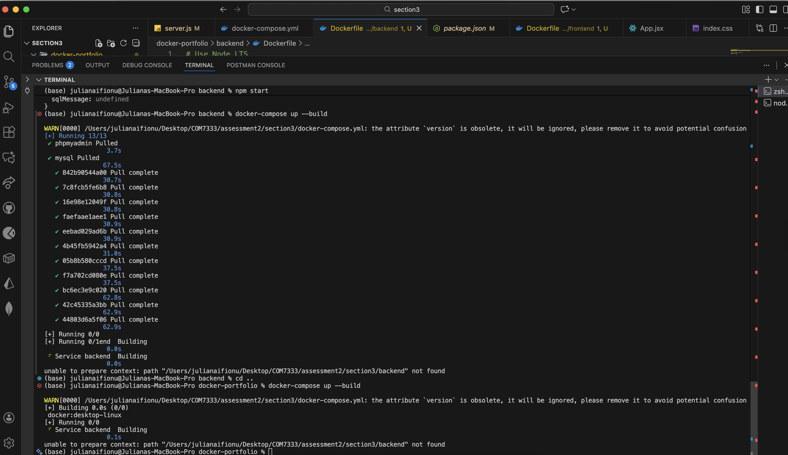
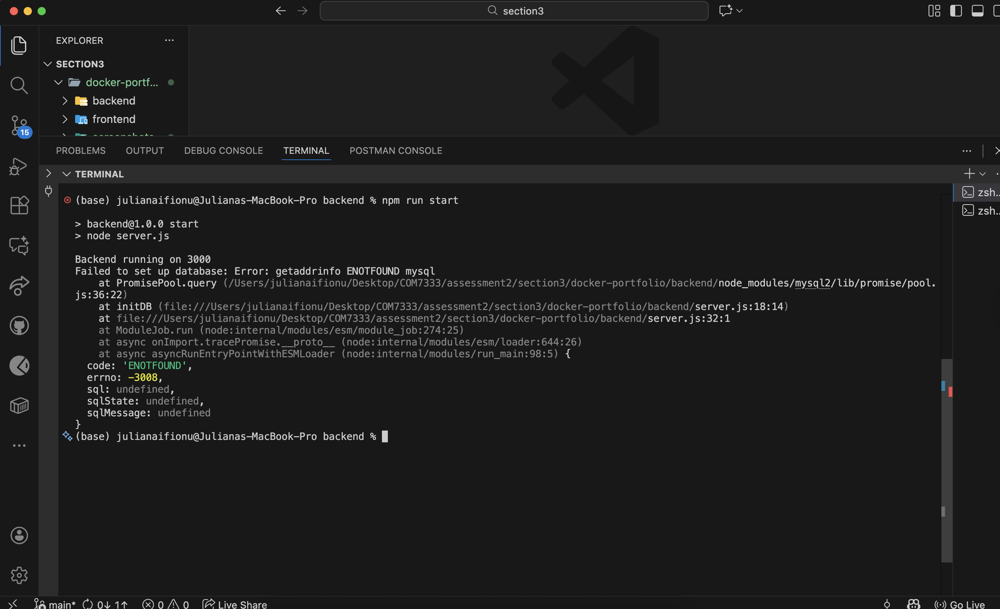

---

## 5. Running the app using Docker Compose

- Learned that running `npm start` locally **bypassed Docker networking**, causing DB errors.
- Correct approach: `docker compose up --build` starts all services and ensures proper communication between containers.
- Verified backend logs show successful connection to MySQL.

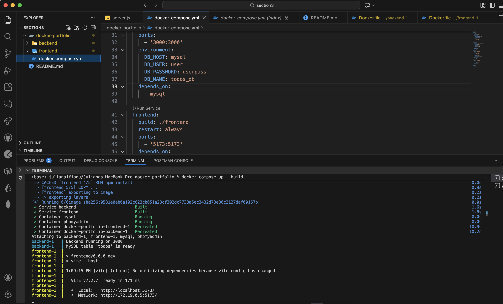
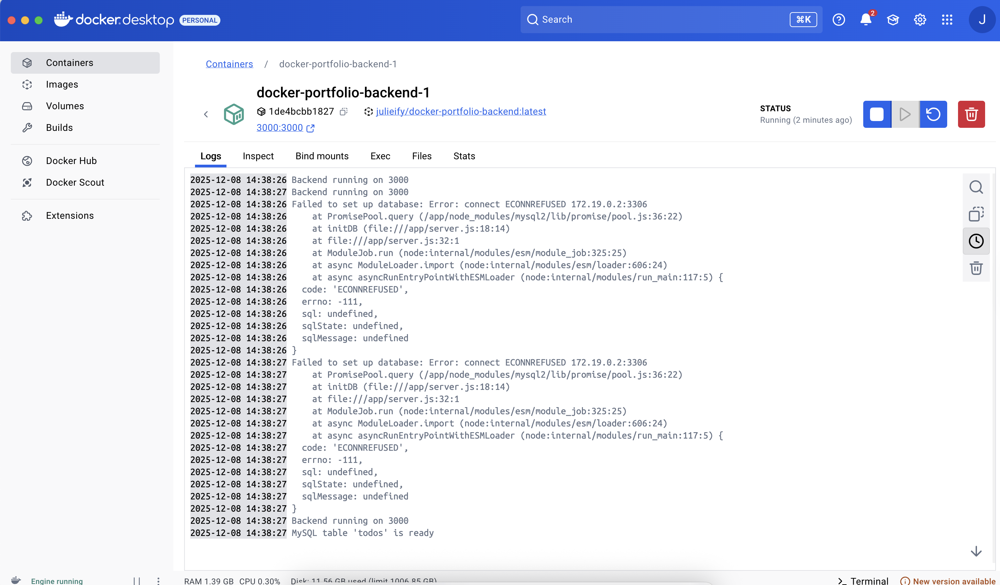

---

## 6. Interacting with the app

- Tested adding and deleting Todos through the frontend.
- Checked that changes are reflected in **MySQL** via **phpMyAdmin**.
- Verified hot-reloading for frontend changes.

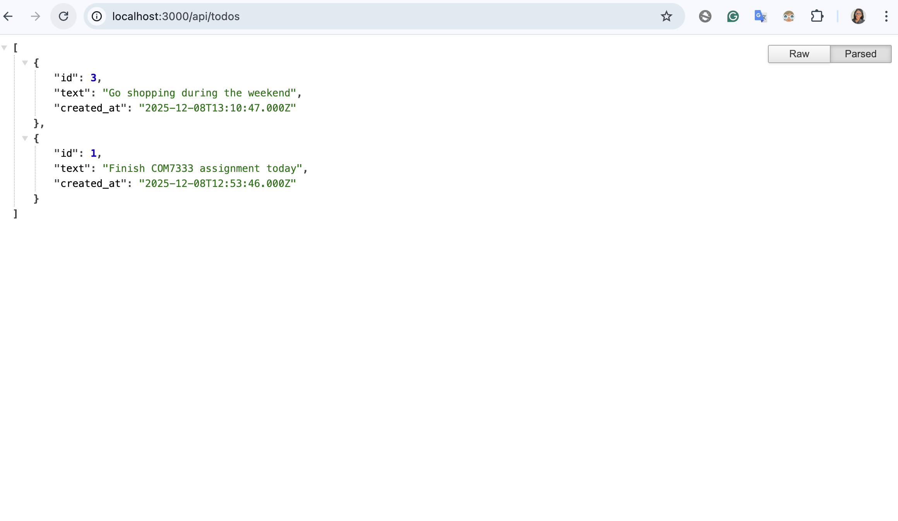
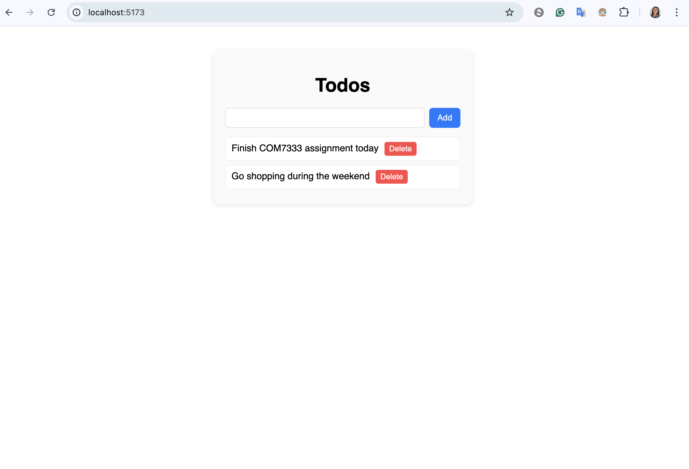


---

## 7. List containers

```bash
docker ps -a # show all containers, including stopped ones

docker ps # show only running containers
```

## 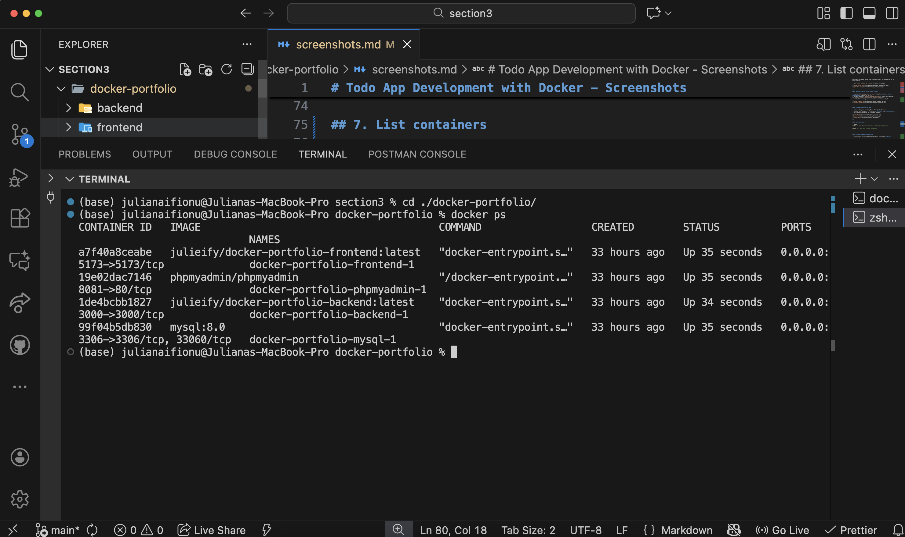

## 8. Pushing images to Docker Hub

- Built images and pushed both backend and frontend to **Docker Hub** for sharing.
- Learned about tagging, versioning, and using public repositories.

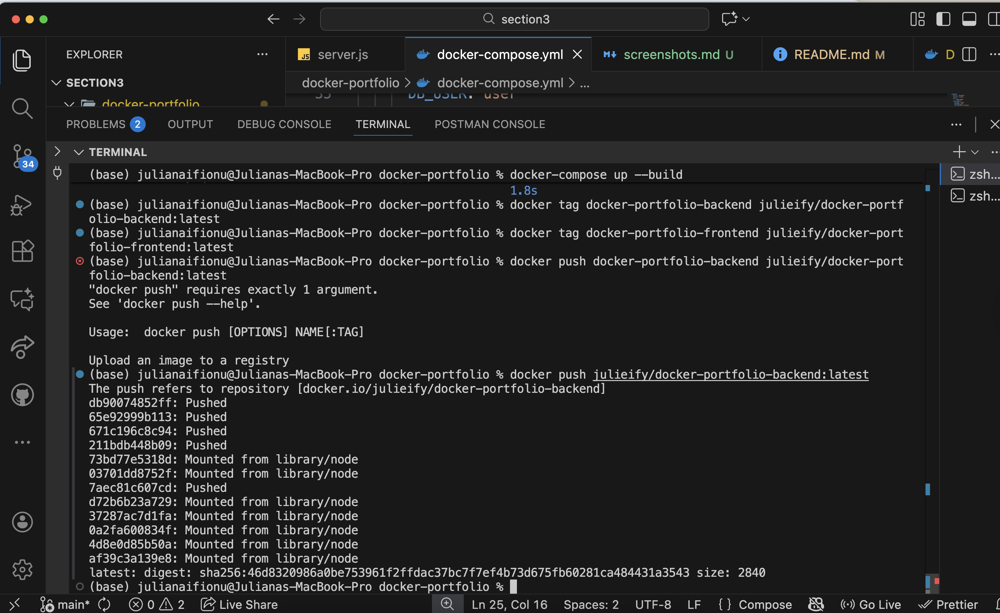

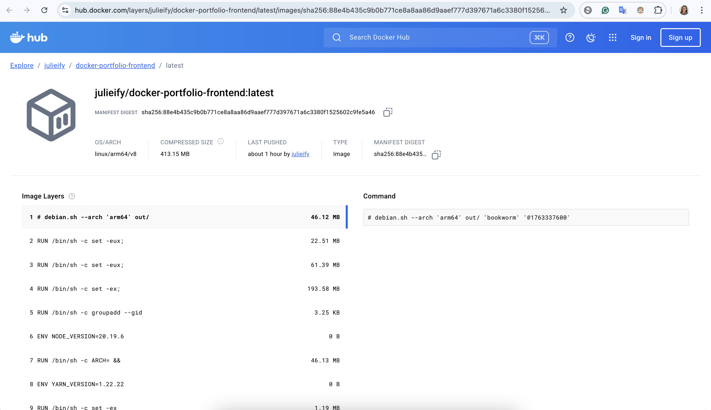

---

## 9. Summary and Lessons Learned

- Containers isolate development environments and prevent dependency conflicts.
- Docker Compose simplifies orchestration of multiple services.
- Push docker images to Docker Hub for others to access
- Other important commands I learned:

```bash
docker build -t backend . # Build an image from a Dockerfile

docker run -p 3000:3000 backend # Run a container from the image
```
